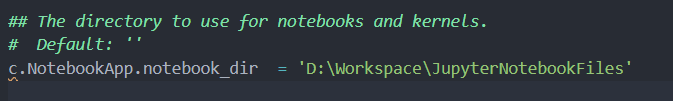

# 实验1——安装相关软件

链接跳转：[主目录](https://github.com/ZW-Q/MySoftware-Development-Practice)	[实验1](https://github.com/ZW-Q/MySoftware-Development-Practice/tree/main/E1)	[实验2](https://github.com/ZW-Q/MySoftware-Development-Practice/tree/main/E2)	[实验3](https://github.com/ZW-Q/MySoftware-Development-Practice/tree/main/E3)	[实验4](https://github.com/ZW-Q/MySoftware-Development-Practice/tree/main/E4)	[实验5](https://github.com/ZW-Q/MySoftware-Development-Practice/tree/main/E5)

```
实验内容
1. 安装Android Studio 4.1 之上的版本，更好的支持 TensorFlow lite。
2. 安装Jupyter Notebook和相关的Python环境，后续用于机器学习模型构建。
3. 探索两个软件的使用方法。
4. 使用Jupyter Notebook将上述安装过程以Markdown语法描述，并上传至Github。
```

------

## 一、卸载Android Studio


### 1、进入控制面板，点击卸载Android Studio


### 2、进入用户目录删除.android和.gradle文件夹

```
C:\Users\qiaoqiao  <qiaoqiao>为用户名
```


### 3、重新启动电脑，即可卸载成功

------

## 二、安装Android Studio 2021.1.1 Patch 3并配置

### 1、去官网下载安装包

[Android Studio官网]: https://developer.android.google.cn/studio


### 2、安装Android Studio

#### ① 运行安装包


#### ② 选择虚拟机


#### ③ 修改安装路径


#### ④ Android Studio IDE安装成功


### 3、修改hosts文件

```
C:\Windows\System32\drivers\etc\hosts
```

#### ① 取消勾选只读选项


#### ② 打开hosts文件


#### ③ 编辑hosts文件

```
#Android 
203.208.40.33 dl.google.com
```


### 4、安装Android SDK

#### ① 启动Android Studio


#### ② 修改安装路径


#### ③ 安装license


#### ④ 安装成功


### 5、新建Helloworld项目

#### ① 选择New Project


#### ② 选择Empty Activity


#### ③ 项目名，项目配置


#### ④ 构建gradle


### 6、安装虚拟机

#### ① Device Manager 选择Create Device


#### ② 选择Pixel 2


#### ③ 下载API 32 


#### ④ 选择API 32并且下一步


#### ⑤ 命名AVD Name，虚拟机安装成功


### 7、运行Helloworld项目

#### ① 启动虚拟机


#### ② 启动app，运行成功


------

## 三、卸载Anaconda

### 1、安装 Anaconda-Clean package
#### ① 打开 Anaconda Prompt


#### ② 输入如下命令

```
conda install anaconda-clean
```


### 2、输入如下命令卸载

```cmd
anaconda-clean
```


### 3、进入Anaconda安装目录，运行Uninstall-Anaconda3.exe


#### 卸载中...


### 4、重新启动电脑，即可卸载成功

------

## 四、安装Anaconda 3并配置

### 1、下载安装包

[Anaconda官网]: https://www.anaconda.com/products/distribution


### 2、安装

#### ①  运行安装包


#### ② Accept License


#### ③ 仅为我安装


#### ④ 修改安装路径


#### ⑤ 注册python，取消勾选配置环境变量


#### ⑥ 安装中


#### ⑦ 安装完成


### 3、打开Anaconda Navigator


#### ① 打开Prompt，输入conda list


#### ② 出现如下即为成功


------

## 五、安装Jupyter Notebook并配置

### 1、方法1：使用pip安装Jupyter Notebook

#### ① 查看Python和pip版本

```
Python -V
pip -V
```

#### ② 升级pip到最新版本

```
pip3 install --upgrade pip
```

#### ③ 安装Jupyter Notebook

```
pip install jupyter
```

#### ④ 安装完成


### 2、方法2：通过Anaconda打开Jupyter Notebook

#### ① 打开Anaconda Navigator

#### ② 打开Jupyter Notebook


#### ③ 出现如下界面即为成功


### 3、修改Jupyter Notebook默认目录

#### ① 打开Anaconda Prompt


#### ② 在Prompt输入命令，生成配置文件

```
jupyter notebook --generate-config
```


#### ③ 打开`jupyter_notebook_config.py`文件，打开后找到`#c.NotebookApp.notebook_dir = ''`这一行代码,删除行首的`#`


#### ④ 将 `' '`中改为所更改的路径



#### ⑤ 再次打开Jupyter Notebook，目录已更改


#### ⑥ 新建Python3编辑文件


