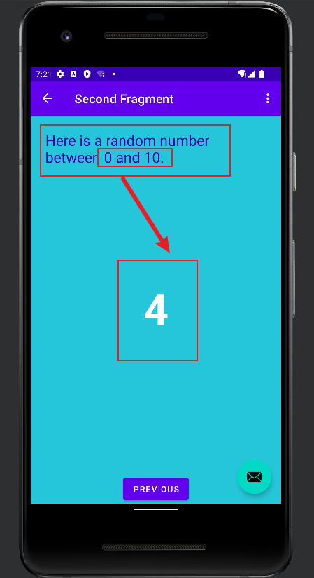

# 实验2——创建首个Kotlin应用

链接跳转：[主目录](https://github.com/ZW-Q/MySoftware-Development-Practice)	[实验1](https://github.com/ZW-Q/MySoftware-Development-Practice/tree/main/E1)	[实验2](https://github.com/ZW-Q/MySoftware-Development-Practice/tree/main/E2)	[实验3](https://github.com/ZW-Q/MySoftware-Development-Practice/tree/main/E3)	[实验4](https://github.com/ZW-Q/MySoftware-Development-Practice/tree/main/E4)	[实验5](https://github.com/ZW-Q/MySoftware-Development-Practice/tree/main/E5)

```
实验内容
1. 掌握Android Studio开发应用的基本流程
2. 掌握Android Studio开发组件的基本用法
3. 初始Kotlin语言的基本要素
4. 掌握Android Navigation的基本用法
```

## 一、创建并运行第一个Kotlin应用程序

### 1、创建新项目My Application

#### ①**New Project**

选择**Basic Activity**


#### ②设置**Project**基础信息

**Language**选择**Kotlin**


#### ③加载gradle


#### ④查看dependencies

进入`app\build.gradle`查看**dependcies**，出现如下界面即为成功


#### ⑤Android Studio界面


### 2、运行新项目My Application

#### ①**Create Device**


#### ②选择API 32镜像


#### ③设置虚拟机基本信息


#### ④启动虚拟机Pixel 2


#### ⑤运行app


## 二、向页面添加更多的布局

### 1、查看布局编辑器

```
app->res->fragment_first.xml
```


#### ①修改**Textview**的**text**属性

进入`fragment_first.xml`，修改**Textview**的**text**属性

```kotlin
android:text="@string/hello_first_fragment"
```

#### ②**Go To > Declaration or Usages**


#### ③跳转到`values/strings.xml`

```kotlin
<string name="hello_first_fragment">Hello first fragment</string>
```

#### ④修改字符串属性值为**“Hello Kotlin!”**

```kotlin
 <string name="hello_first_fragment">Hello Kotlin！</string>
```

#### ⑤修改字体显示属性

在**Design**视图中选择**textview_first**文本组件，在**Common Attributes**属性下的**textAppearance**域，设置相关的文字显示属性


#### ⑥查看xml代码，可见属性修改成功

```kotlin
android:fontFamily="sans-serif-condensed"
android:text="@string/hello_first_fragment"
android:textColor="@android:color/darker_gray"
android:textSize="30sp"
android:textStyle="bold"
```

#### ⑦重新运行程序查看效果


### 2、查看视图的布局约束

#### ①查看**TextView**组件的约束属性

```kotlin
app:layout_constraintBottom_toTopOf="@id/button_first"
app:layout_constraintEnd_toEndOf="parent"
app:layout_constraintHorizontal_bias="0.498"
app:layout_constraintStart_toStartOf="parent"
app:layout_constraintTop_toTopOf="parent" />
```

#### ②添加按钮和约束


调整**Button**的约束，设置**Button**的`Top>BottonOf textView`

```kotlin
app:layout_constraintTop_toBottomOf="@+id/textview_first" />
```

随后添加**Button**的左侧约束至屏幕的左侧，**Button**的底部约束至屏幕的底部

```kotlin
app:layout_constraintBottom_toBottomOf="parent"
app:layout_constraintStart_toStartOf="parent"
app:layout_constraintTop_toBottomOf="@+id/textview_first"
```

查看**Attributes**面板，修改将id从`button`修改为`toast_button`（注意修改id将重构代码）


查看此**Button**的**xml**文件

```xml
<Button
        android:id="@+id/toast_button"
        android:layout_width="wrap_content"
        android:layout_height="wrap_content"
        android:layout_marginStart="28dp"
        android:layout_marginTop="212dp"
        android:layout_marginBottom="216dp"
        android:text="Button"
        app:layout_constraintBottom_toBottomOf="parent"
        app:layout_constraintStart_toStartOf="parent"
        app:layout_constraintTop_toBottomOf="@+id/textview_first"
/>
```

#### ③调整Next按钮

删除**Next**和**TextView**之间的链，可以在设计视图右键相应约束，选择**Delete**


#### ④添加新的约束

添加**Next**的右边和底部约束至父类屏幕，**Next**的**Top**约束至**TextView**的底部。最后，**TextView**的底部约束至屏幕的底部。效果看起来如下图所示：


### 3、更改组件的文本

#### ①查看toast_button按钮属性

```kotlin
android:id="@+id/toast_button"
android:layout_width="wrap_content"
android:layout_height="wrap_content"
android:layout_marginStart="36dp"
android:layout_marginTop="212dp"
android:text="Button"
```

#### ②修改按钮属性

选择**Show Context Actions**，并选择**Extract string resource**


修改**Resource name** 和**Resource value**


### 4、更新Next按钮

#### ①修改按钮id

在属性面板中更改**Next**按钮的**id**，从`button_first`改为`random_button`


#### ②修改按钮属性

在`string.xml`文件，右键**next**字符串资源，选择 **Refactor > Rename**，修改资源名称为**`random_button_text`**，点击**Refactor** 。随后，修改**Next**值为**`Random`**

```kotlin
<string name="random_button_text">Random</string>
```


### 5、添加第三个按钮

#### ①添加按钮

按钮位于**Toast**和**Random**按钮之间，**TextView**的下方。新**Button**的左右约束分别约束至**Toast**和**Random**，**Top**约束至**TextView**的底部，**Buttom**约束至屏幕的底部


#### ②按钮属性代码

```xml
<Button
android:id="@+id/button2"
android:layout_width="wrap_content"
android:layout_height="wrap_content"
android:text="Button"
app:layout_constraintBottom_toBottomOf="parent"
app:layout_constraintEnd_toStartOf="@+id/random_button"
app:layout_constraintStart_toEndOf="@+id/toast_button"
app:layout_constraintTop_toBottomOf="@+id/textview_first" />
```

### 6、完善UI组件的属性

#### ①修改按钮id

更改新增按钮id为**`count_button`**


#### ②修改属性值

显示字符串为**Count**，对应字符串资源值为**`count_button_text`**


#### ③修改**TextView**文本

```kotlin
<string name="hello_first_fragment">0</string>
```

#### ④`fragment_first.xml`文件

```xml
<?xml version="1.0" encoding="utf-8"?>
<androidx.constraintlayout.widget.ConstraintLayout xmlns:android="http://schemas.android.com/apk/res/android"
    xmlns:app="http://schemas.android.com/apk/res-auto"
    xmlns:tools="http://schemas.android.com/tools"
    android:layout_width="match_parent"
    android:layout_height="match_parent"
    tools:context=".FirstFragment">

    <TextView
        android:id="@+id/textview_first"
        android:layout_width="wrap_content"
        android:layout_height="wrap_content"
        android:fontFamily="sans-serif-condensed"
        android:text="@string/hello_first_fragment"
        android:textColor="@android:color/darker_gray"
        android:textSize="30sp"
        android:textStyle="bold"
        app:layout_constraintBottom_toBottomOf="parent"
        app:layout_constraintEnd_toEndOf="parent"
        app:layout_constraintStart_toStartOf="parent"
        app:layout_constraintTop_toTopOf="parent"
        app:layout_constraintVertical_bias="0.3"
        />

    <Button
        android:id="@+id/random_button"
        android:layout_width="wrap_content"
        android:layout_height="wrap_content"
        android:text="@string/random_button_text"
        app:layout_constraintBottom_toBottomOf="parent"
        app:layout_constraintEnd_toEndOf="parent"
        app:layout_constraintTop_toBottomOf="@id/textview_first"
        />

    <Button
        android:id="@+id/toast_button"
        android:layout_width="wrap_content"
        android:layout_height="wrap_content"
        android:text="@string/toast_button_text"
        app:layout_constraintBottom_toBottomOf="parent"
        app:layout_constraintStart_toStartOf="parent"
        app:layout_constraintTop_toBottomOf="@+id/textview_first"
        />

    <Button
        android:id="@+id/count_button"
        android:layout_width="wrap_content"
        android:layout_height="wrap_content"
        android:text="@string/count_button_text"
        app:layout_constraintBottom_toBottomOf="parent"
        app:layout_constraintEnd_toStartOf="@+id/random_button"
        app:layout_constraintStart_toEndOf="@+id/toast_button"
        app:layout_constraintTop_toBottomOf="@+id/textview_first" />
</androidx.constraintlayout.widget.ConstraintLayout>
```

#### ⑤运行程序查看效果


## 三、更新按钮和文本框的外观

### 1、添加新的颜色资源

在`values->colors.xml`添加新的颜色

```xml
<color name="screenBackground">#2196F3</color>
<color name="buttonBackground">#BBDEFB</color>
```

### 2、设置组件的外观

#### ①设置屏幕背景色

设置屏幕背景色为`@color/screenBackground`


#### ②设置按钮背景色

设置每个按钮的背景色为`@color/buttonBackground`


#### ③设置TextView属性

移除**TextView**的背景颜色，设置**TextView**的文本颜色为`color/white`，并增大字体大小至**72sp**


### 3、设置组件的位置

#### ①设置按钮位置

Toast与屏幕的左边距设置为24dp

```kotlin
android:layout_marginStart="24dp"
```

Random与屏幕的右边距设置为24dp

```kotlin
android:layout_marginEnd="24dp"
```

#### ②设置TextView位置

垂直偏移为0.3

```kotlin
app:layout_constraintVertical_bias="0.3"
```

### 4、运行程序查看效果


## 四、添加代码完成应用程序交互

### 1、TOAST按钮添加toast消息

#### ①设置**randomButton**按钮的事件

打开`FirstFragment.kt`文件，在`onViewCreated`方法中使用绑定机制设置**randomButton**按钮的响应事件

```kotlin
override fun onViewCreated(view: View, savedInstanceState: Bundle?) {
    super.onViewCreated(view, savedInstanceState)

    binding.randomButton.setOnClickListener {
        findNavController().navigate(R.id.action_FirstFragment_to_SecondFragment)
    }
}
```

#### ②设置TOAST按钮的事件

为**TOAST**按钮添加事件，使用**findViewById()**查找按钮**id**

```kotlin
// find the toast_button by its ID and set a click listener
view.findViewById<Button>(R.id.toast_button).setOnClickListener {
    // create a Toast with some text, to appear for a short time
    val myToast = Toast.makeText(context, "Hello Toast!", Toast.LENGTH_LONG)
    // show the Toast
    myToast.show()
}
```

### 2、**Count**按钮更新屏幕的数字

#### ①设置**count_buttion**按钮的事件

在`FirstFragment.kt`文件，为**count_buttion**按钮添加事件

```kotlin
view.findViewById<Button>(R.id.count_button).setOnClickListener {
   countMe(view)
}
```

#### ②新增`countMe()`方法

`countMe()`为自定义方法，以**View**为参数，每次点击增加数字**1**

```kotlin
//    count方法，自增1
private fun countMe(view: View) {
    // Get the text view
    val showCountTextView = view.findViewById<TextView>(R.id.textview_first)

    // Get the value of the text view.
    val countString = showCountTextView.text.toString()

    // Convert value to a number and increment it
    var count = countString.toInt()
    count++

    // Display the new value in the text view.
    showCountTextView.text = count.toString()
}
```

## 五、完成界面二的设计

### 1、新增TextView显示随机数

#### ①查看布局

打开`fragment_second.xml`，查看**TextView**和**Button**


#### ②删除约束

去掉**TextView**和**Button**之间的约束


#### ③新增TextView

拖动新的**TextView**至屏幕的中间位置，用来显示随机数


#### ④设置TextView的id

设置新的**TextView**的**id**为**`@+id/textview_random`**

```kotlin
android:id="@+id/textview_random"
```

#### ⑤设置TextView的约束

设置新的**TextView**的左右约束至屏幕的左右侧，**Top**约束至**textview_second**的**Bottom**，**Bottom**约束至**Button**的**Top**

```kotlin
app:layout_constraintBottom_toTopOf="@+id/button_second"
app:layout_constraintEnd_toEndOf="parent"
app:layout_constraintStart_toStartOf="parent"
app:layout_constraintTop_toBottomOf="@+id/textview_second"
```

#### ⑥设置TextView的字体颜色

设置**TextView**的字体颜色**textColor**属性为**`@android:color/white`**，**textSize**为**72sp**，**textStyle**为**bold**

```kotlin
android:textColor="@android:color/white"
android:textSize="72sp"
android:textStyle="bold"
```

#### ⑦设置TextView的文字

设置**TextView**的显示文字为“**R**”

```kotlin
android:text="R"
```

#### ⑧设置TextView的偏移

设置垂直偏移量**layout_constraintVertical_bias**为**0.45**

```kotlin
app:layout_constraintVertical_bias="0.45"
```

#### ⑨新增TextView的布局代码

```xml
<TextView
   android:id="@+id/textview_random"
   android:layout_width="wrap_content"
   android:layout_height="wrap_content"
   android:text="R"
   android:textColor="@android:color/white"
   android:textSize="72sp"
   android:textStyle="bold"
   app:layout_constraintBottom_toTopOf="@+id/button_second"
   app:layout_constraintEnd_toEndOf="parent"
   app:layout_constraintStart_toStartOf="parent"
   app:layout_constraintTop_toBottomOf="@+id/textview_second"
   app:layout_constraintVertical_bias="0.45" />
```

### 2、更新显示界面文本的TextView(textview_second)

#### ①查看文本

在`fragment_second.xml`文件中，新增条目

```kotlin
android:text="@string/hello_second_fragment"
```

对应的`string.xml`中其文本为

```kotlin
<string name="hello_second_fragment">Hello second fragment. Arg: %1$s</string>
```

#### ②更改id

更改该文本框id为`textview_header`


#### ③设置布局

设置layout_width为*`match_parent`**，layout_height为**`wrap_content`


#### ④设置边距

设置top，left和right的margin为24dp，左边距和右边距也就是start和end边距


#### ⑤删除约束


#### ⑥设置颜色

向`colors.xml`添加颜色`colorPrimaryDark`，并将TextView颜色设置为`@color/colorPrimaryDark`，字体大小为**24sp**

```kotlin
<color name="colorPrimaryDark">#3700B3</color>
```


#### ⑦设置文字

`strings.xml`文件中，修改`hello_second_fragment`的值为`Here is a random number between 0 and %d.`

```kotlin
<string name="hello_second_fragment">Here is a random number between 0 and %d.</string>
```

#### ⑧设置ResourceName

使用**Refactor>Rename**将`hello_second_fragment` 重构为`random_heading`


#### ⑨该TextView的布局代码

```xml
<TextView
   android:id="@+id/textview_header"
   android:layout_width="0dp"
   android:layout_height="wrap_content"
   android:layout_marginStart="24dp"
   android:layout_marginLeft="24dp"
   android:layout_marginTop="24dp"
   android:layout_marginEnd="24dp"
   android:layout_marginRight="24dp"
   android:text="@string/random_heading"
   android:textColor="@color/colorPrimaryDark"
   android:textSize="24sp"
   app:layout_constraintEnd_toEndOf="parent"
   app:layout_constraintStart_toStartOf="parent"
   app:layout_constraintTop_toTopOf="parent" />
```

### 3、更改界面的背景色和按钮布局

#### ①设置背景色

向`colors.xml`文件添加第二个Fragment背景色的值，修改`fragment_second.xml`背景色的属性为`screenBackground2`

```kotlin
<color name="screenBackground2">#26C6DA</color>
```


#### ②设置按钮布局

将按钮移动至界面的底部，效果如下所示


### 4、检查导航图

打开`nav_graph.xml`文件（**res>navigation>nav_graph.xml**），效果如下


### 5、启用SafeArgs

- 注：Android Studio Bumblebee | 2021.1.1 Patch 3使用的gradle的版本为7.2，而该版本中的`build.gradle`使用`plugins`代替了`buildscript`，两者无法共存，但可以注释`plugins`使用`buildscript`

#### ①引入插件

打开 `Gradle Scripts > build.gradle(Project: My_Application)`，注释`plugins`并添加如下代码

```kotlin
buildscript {
    repositories {
        google()
    }
    dependencies {
        val nav_version = "2.4.2"
        classpath("androidx.navigation:navigation-safe-args-gradle-plugin:$nav_version")
    }
}
```


#### ②应用插件

打开 `Gradle Scripts > build.gradle (Module:My_Application.app)`，在`plugins`下添加如下代码

```kotlin
id 'androidx.navigation.safeargs.kotlin'
```


#### ③同步依赖库，出现错误

```
Could not resolve all artifacts for configuration ':classpath'
```


#### ④解决方案

在`buildscript`中添加如下代码，并配合科学上网方式

```
repositories {
        mavenCentral()
        google()
    }
```

gradle sync成功


#### ⑤重新生成工程**Build > Make Project**


### 6、创建导航动作的参数

#### ①查看`FirstFragment`导航视图

打开`nav_graph.xml`，点击`FirstFragment`，查看其属性


#### ②查看导航Actions

在`Actions`栏中可以看到导航至`SecondFragment`


#### ③查看`SecondFragment`导航视图


#### ④添加Arguments

弹出的对话框中，添加参数`myArg`，类型为整型`Integer`


### 7、FirstFragment添加代码，向SecondFragment发数据

#### ①修改Random按钮响应代码

打开`FirstFragment.kt`源代码文件，找到`onViewCreated()`方法，该方法在`onCreateView()`方法之后被调用，可以实现组件的初始化。找到Random按钮的响应代码，注释掉原先的事件处理代码


#### ②实例化TextView

实例化**TextView**，获取**TextView**中文本并转换为整数值

```kotlin
val showCountTextView = view.findViewById<TextView>(R.id.textview_first)
val currentCount = showCountTextView.text.toString().toInt()
```


#### ④定义参数传递

将`currentCount`作为参数传递给`actionFirstFragmentToSecondFragment()`

```kotlin
val action = FirstFragmentDirections.actionFirstFragmentToSecondFragment(currentCount)
```


#### ⑤添加导航事件代码

```kotlin
findNavController().navigate(action)
```


#### ⑥重新运行程序，查看效果

运行代码，点击**FirstFragment**的**Count**按钮，然后点击**Random**按钮，可以看到**SecondFragment**在头部的**TextView**已经显示正确的数字，但是屏幕中间还未出现随机数显示

### 8、添加SecondFragment的代码

#### ①导入navArgs包

```kotlin
//导入navArgs包
import androidx.navigation.fragment.navArgs
```


#### ②添加代码

在`onViewCreated()`方法之前添加如下代码，通过**navArgs**定义参数

```kotlin
val args: SecondFragmentArgs by navArgs()
```


#### ③获取参数并显示

在`onViewCreated()`中获取传递过来的参数列表，提取**count**数值，并在**textview_header**中显示

```kotlin
val count = args.myArg
val countText = getString(R.string.random_heading, count)
view.findViewById<TextView>(R.id.textview_header).text = countText
```


#### ④根据count值生成随机数

```kotlin
val random = java.util.Random()
var randomNumber = 0
if (count > 0) {
   randomNumber = random.nextInt(count + 1)
}
```


#### ⑤textview_random中显示count值

```kotlin
view.findViewById<TextView>(R.id.textview_random).text = randomNumber.toString()
```


#### ⑥重新运行程序，查看效果

程序报错

```
Class 'ActionFirstFragmentToSecondFragment' is not abstract and does not implement abstract member public abstract val actionId: Int defined in androidx.navigation.NavDirections
```


#### 解决方案

此时，进入`build.gradle(My_Application.app)`，将如下的代码

```
id 'androidx.navigation.safeargs.kotlin'
```

去掉kotlin，改为：

```
id 'androidx.navigation.safeargs'
```


重新运行程序，效果如下即为成功



