# 实验3——基于TensorFlow Lite实现的Android花卉识别应用

链接跳转：[主目录](https://github.com/ZW-Q/MySoftware-Development-Practice)	[实验1](https://github.com/ZW-Q/MySoftware-Development-Practice/tree/main/E1)	[实验2](https://github.com/ZW-Q/MySoftware-Development-Practice/tree/main/E2)	[实验3](https://github.com/ZW-Q/MySoftware-Development-Practice/tree/main/E3)	[实验4](https://github.com/ZW-Q/MySoftware-Development-Practice/tree/main/E4)	[实验5](https://github.com/ZW-Q/MySoftware-Development-Practice/tree/main/E5)

```
实验内容
1. 按照教程构建基于TensorFlow Lite的Android花卉识别应用。
2. 查看该应用的代码框架，特别注意CameraX库(AndroidX.camera.*)和数据视图模型的使用。
3. 上传完成既定功能的代码至Github，并撰写详细的Readme文档。
```

## 一、下载TFLClassify项目

```
git clone git@github.com:hoitab/TFLClassify.git
```

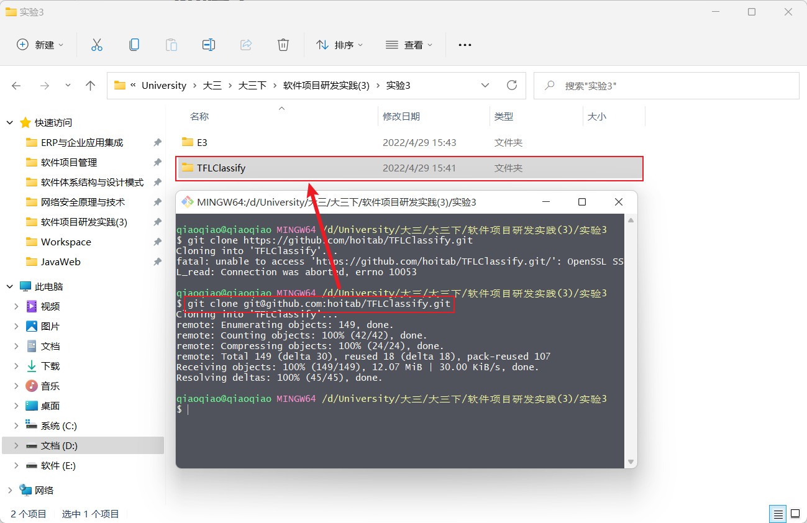

## 二、运行TFLCLassify项目

### 1、打开TFLCLassify项目

```
open project->TFLClassify
```

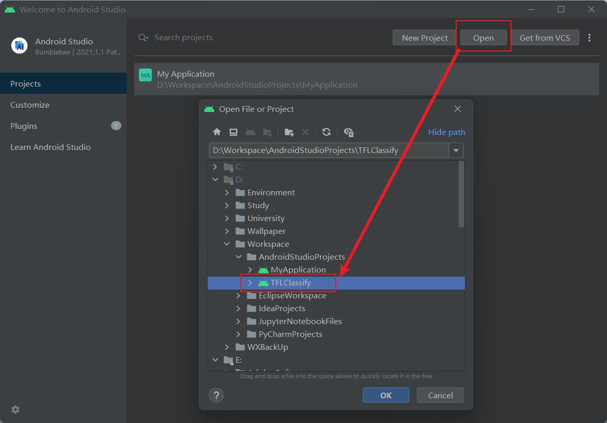

### 2、gradle sync

第一次打开该项目需要gradle sync，出现错误

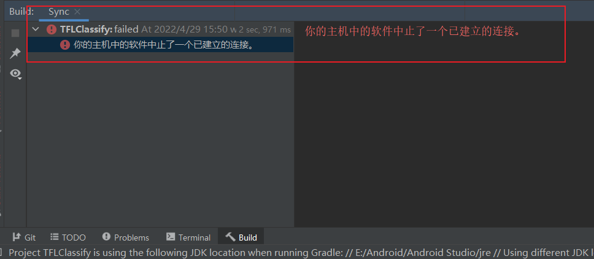

#### 解决方案

查阅资料，得知原因是电脑开启了移动热点，并且iPad连接了此热点，此时将移动热点关闭即可正常gradle sync


并修改项目的gradle和gradle-plugin版本为当前版本

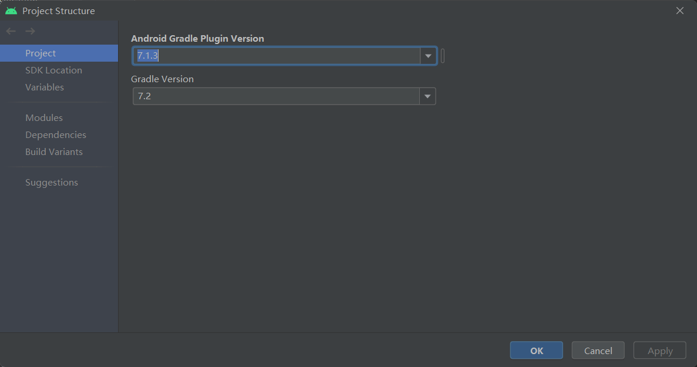

gradle sync 完成

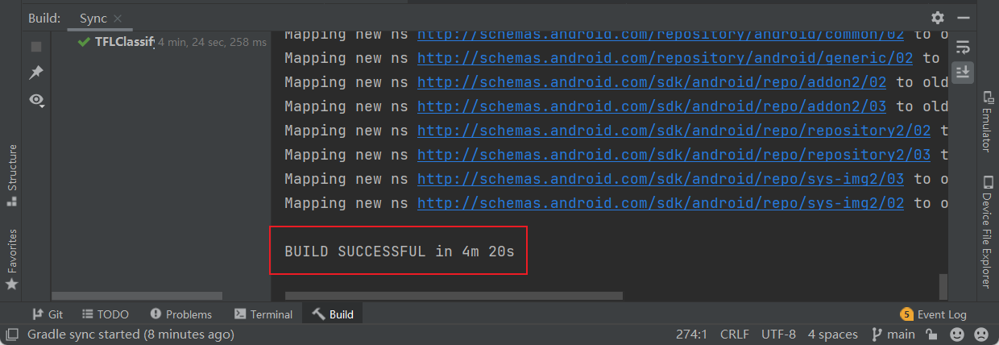

### 3、项目结构

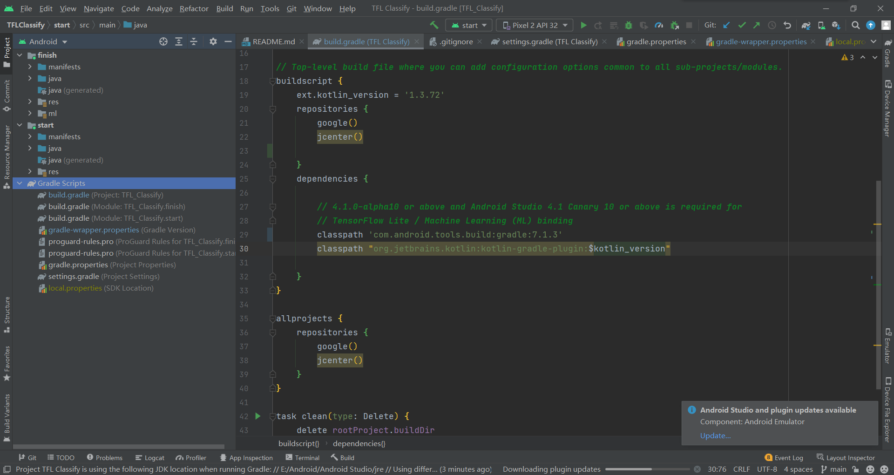

## 三、添加TensorFlow Lite

### 1、新增Model

右键start模块，然后`New>Other>TensorFlow Lite Model`

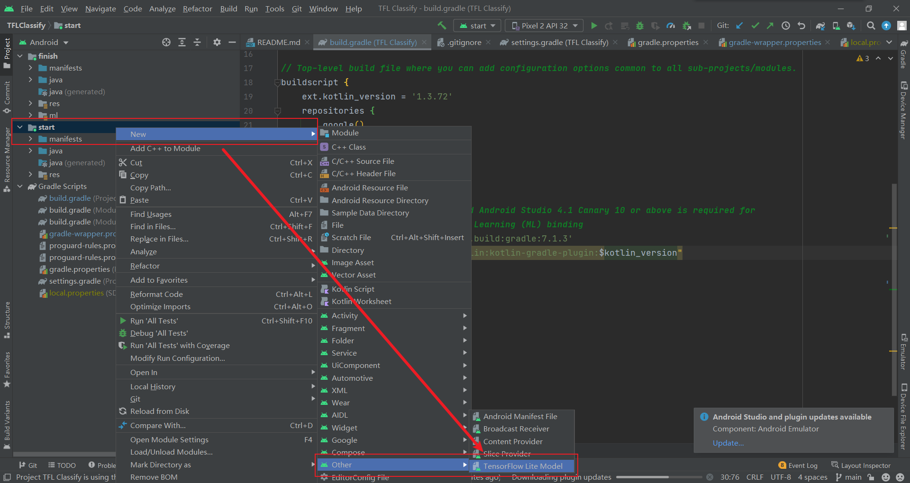

### 2、选择Model

选择**finish**模块中的`ml->FlowerModel.tflite`，点击**Finish**完成模型导入，系统将自动下载模型的依赖包并将依赖项添加至模块的`build.gradle`文件

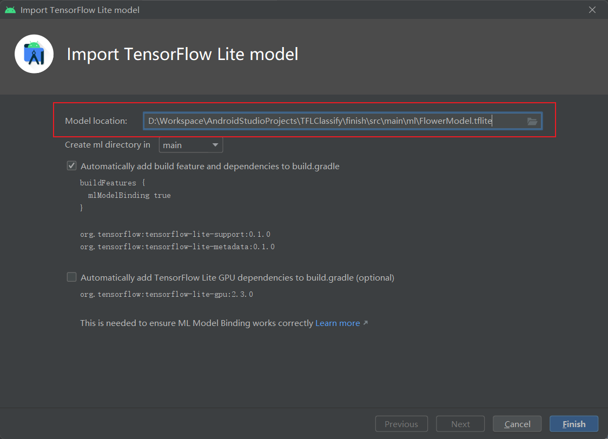

### 3、添加完成

最终TensorFlow Lite模型被成功导入，并生成摘要信息

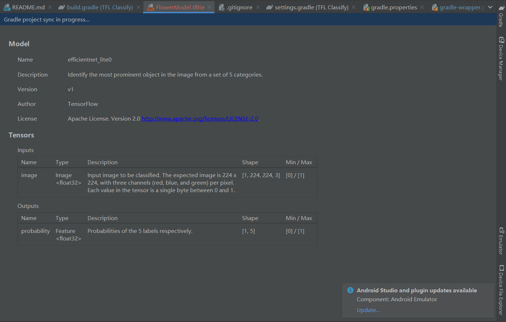

## 四、查看TODO

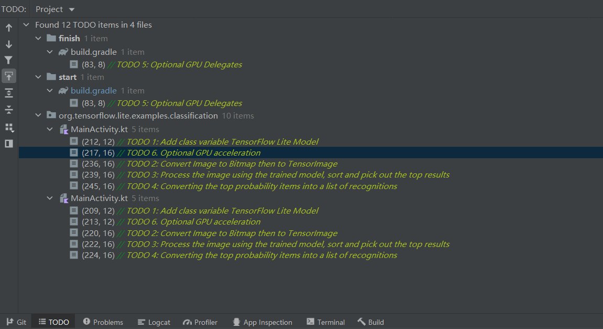

## 五、添加代码重新运行APP

### 1、添加初始化训练模型的代码

定位**start**模块`MainActivity.kt`文件的**TODO 1**，添加初始化训练模型的代码

```kotlin
// TODO 1: Add class variable TensorFlow Lite Model
// Initialize the Flower Model
private val flowerModel = FlowerModel.newInstance(ctx)
```

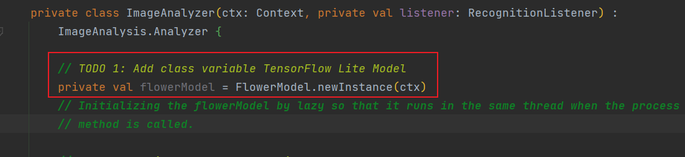

### 2、转换摄像头的输入

在**CameraX**的`analyze（）`方法内部，需要将摄像头的输入`ImageProxy`转化为`Bitmap`对象，并进一步转化为`TensorImage` 对象

```kotlin
// TODO 2: Convert Image to Bitmap then to TensorImage
val tfImage = TensorImage.fromBitmap(toBitmap(imageProxy))
```

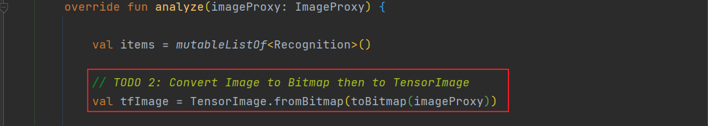

### 3、对图像进行处理并生成结果

①按照属性`score`对识别结果按照概率从高到低排序

②列出最高k种可能的结果，k的结果由常量`MAX_RESULT_DISPLAY`定义

```kotlin
// TODO 3: Process the image using the trained model, sort and pick out the top results
val outputs = flowerModel.process(tfImage)
    .probabilityAsCategoryList.apply {
        sortByDescending { it.score } // Sort with highest confidence first
    }.take(MAX_RESULT_DISPLAY) // take the top results
```

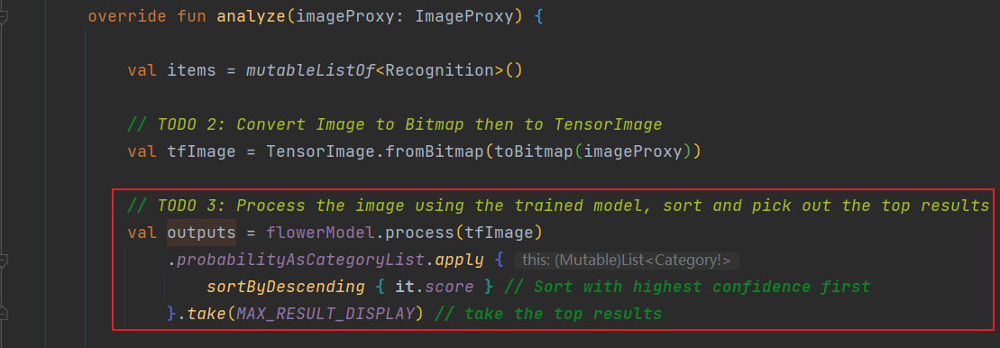

### 4、加入识别结果

将识别的结果加入数据对象`Recognition` 中，包含`label`和`score`两个元素。后续将用于`RecyclerView`的数据显示

```kotlin
// TODO 4: Converting the top probability items into a list of recognitions
for (output in outputs) {
    items.add(Recognition(output.label, output.score))
}
```

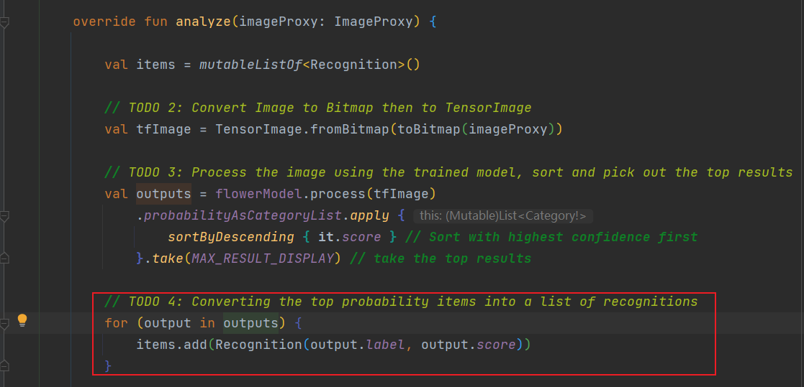

### 5、将原先用于虚拟显示识别结果的代码注释掉或者删除

```kotlin
// // START - Placeholder code at the start of the codelab. Comment this block of code out.
// for (i in 0 until MAX_RESULT_DISPLAY){
//     items.add(Recognition("Fake label $i", Random.nextFloat()))
// }
// // END - Placeholder code at the start of the codelab. Comment this block of code out.
```


### 6、以物理设备重新运行start模块并查看最终运行效果


