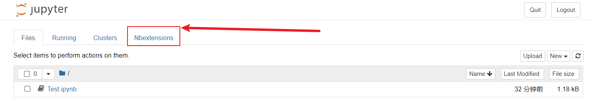
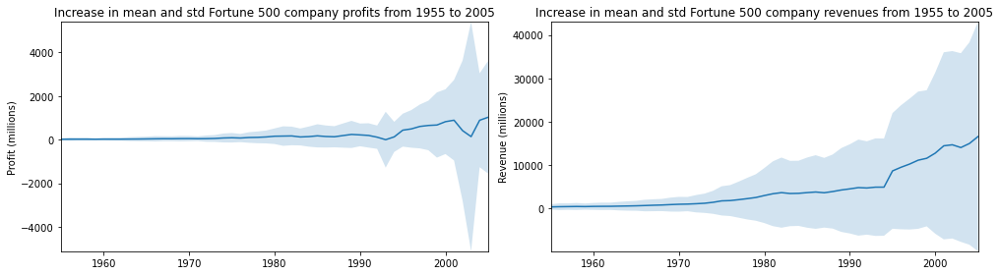

# 实验4——Jupyter Notebook实践

链接跳转：[主目录](https://github.com/ZW-Q/MySoftware-Development-Practice)	[实验1](https://github.com/ZW-Q/MySoftware-Development-Practice/tree/main/E1)	[实验2](https://github.com/ZW-Q/MySoftware-Development-Practice/tree/main/E2)	[实验3](https://github.com/ZW-Q/MySoftware-Development-Practice/tree/main/E3)	[实验4](https://github.com/ZW-Q/MySoftware-Development-Practice/tree/main/E4)	[实验5](https://github.com/ZW-Q/MySoftware-Development-Practice/tree/main/E5)

```
实验内容
1. 安装Jupyter Notebook和相关的Python环境，建议采用Anaconda的安装方式。
2. 按照教程完成实验过程，主要包括几个方面：
	• 掌握Notebook工具的基本原理
	• 学习Python基本语法，完成选择排序程序
	• 完成Python数据分析的例子
	• 将上述完成的Jupyter Notebook在Github上进行共享
3. 上传完成既定功能的代码至Github，并撰写详细的Readme文档。
```

## 一、Jupyter Notebook初始化

### 1、安装Jupyter Notebook

实验1已经安装**Anaconda**、**Jupyter Notebook**并修改其默认目录为`D:\Workspace\JupyterNotebookFiles`


### 2、打开Jupyter Notebook


### 3、Jupyter Notebook扩展工具

#### ①打开CMD.exe Prompt

首先**Anaconda Navigator**中启动命令行终端**CMD.exe Prompt**


#### ②输入安装命令

在弹出的终端中依次输入下面4条命令，注意要耐心等待命令执行完成

建议在`pip install`时候使用清华大学的源`https://pypi.tuna.tsinghua.edu.cn/simple/`，否则可能安装失败

```shell
pip install -i https://pypi.tuna.tsinghua.edu.cn/simple/ jupyter_contrib_nbextensions

jupyter contrib nbextension install --user

pip install -i https://pypi.tuna.tsinghua.edu.cn/simple/ jupyter_nbextensions_configurator

jupyter nbextensions_configurator enable --user
```


此时安装完成，重新打开`Jupyter Notebook`启动页面，可以看到：



#### ③配置Nbextensions

选择**disable-->Hinterland**，重新打开**Notebook**查看效果


## 二、创建一个新的Notebook

### 1、新建Notebook

新建一个**Notebook Python 3 (ipykernel)**，生成了一个`Untitled.ipynb`文件，将其改名为`E4.ipynb`


### 2、测试代码

在`cell`中输入`print("hello world")`并使用`kernel`执行代码


```python
print("hello world")
```

    hello world


代码执行之后，`cell`左侧的标签从`In [ ]` 变成了 `In [1]`。`In`代表输入，`[]`中的数字代表kernel执行的顺序，而`In [*]`则表示代码`cell`正在执行代码。以下例子显示了短暂的`In [*]`过程


```python
import time
time.sleep(3)
```

### 3、Python选择排序

定义selection_sort函数执行选择排序功能。
定义test函数进行测试，执行数据输入，并调用selection_sort函数进行排序，最后输出结果


```python
def selection_sort(data, reverse=False):
    """
    :param data: list type data
    :param reverse:
    :return: list type data
    """
    if not reverse:
        for i in range(len(data)-1):
            min_index = i
            for j in range(i+1, len(data)):
                if data[j] < data[min_index]:
                    min_index = j
            data[i], data[min_index] = data[min_index], data[i]
        return data
    else:
        for i in range(len(data) - 1):
            min_index = i
            for j in range(i+1, len(data)):
                if data[j] > data[min_index]:
                    min_index = j
            data[i], data[min_index] = data[min_index], data[i]
        return data
def test():
    list=[1,6,4,8,3,45,10]
    sortedList=selection_sort(list)
    print(sortedList)
test()
```

    [1, 3, 4, 6, 8, 10, 45]


## 三、数据分析

### 1、下载数据

历年财富世界500强的数据(1955-2005)，并将其保存在JupyterNotebookFiles文件夹中


### 2、基础设置

#### ①导入相关的工具库

- `pandas`用于数据处理，`matplotlib`用于绘图，`seaborn`使绘图更美观
- 第一行不是python命令，而被称为line magic。%表示作用与一行，%%表示作用于全文
- 此处%matplotlib inline 表示使用matlib画图，并将图片输出


```python
%matplotlib inline
import pandas as pd
import matplotlib.pyplot as plt
import seaborn as sns
```

#### ②加载数据集


```python
df = pd.read_csv('fortune500.csv')
```

#### ③检查数据集

df对象数据表的前面5行


```python
df.head()
```


<div>
<style scoped>
    .dataframe tbody tr th:only-of-type {
        vertical-align: middle;
    }

    .dataframe tbody tr th {
        vertical-align: top;
    }
    
    .dataframe thead th {
        text-align: right;
    }
</style>
<table border="1" class="dataframe">
  <thead>
    <tr style="text-align: right;">
      <th></th>
      <th>Year</th>
      <th>Rank</th>
      <th>Company</th>
      <th>Revenue (in millions)</th>
      <th>Profit (in millions)</th>
    </tr>
  </thead>
  <tbody>
    <tr>
      <th>0</th>
      <td>1955</td>
      <td>1</td>
      <td>General Motors</td>
      <td>9823.5</td>
      <td>806</td>
    </tr>
    <tr>
      <th>1</th>
      <td>1955</td>
      <td>2</td>
      <td>Exxon Mobil</td>
      <td>5661.4</td>
      <td>584.8</td>
    </tr>
    <tr>
      <th>2</th>
      <td>1955</td>
      <td>3</td>
      <td>U.S. Steel</td>
      <td>3250.4</td>
      <td>195.4</td>
    </tr>
    <tr>
      <th>3</th>
      <td>1955</td>
      <td>4</td>
      <td>General Electric</td>
      <td>2959.1</td>
      <td>212.6</td>
    </tr>
    <tr>
      <th>4</th>
      <td>1955</td>
      <td>5</td>
      <td>Esmark</td>
      <td>2510.8</td>
      <td>19.1</td>
    </tr>
  </tbody>
</table>
</div>


df对象数据表的最后5行


```python
df.tail()
```


<div>
<style scoped>
    .dataframe tbody tr th:only-of-type {
        vertical-align: middle;
    }

    .dataframe tbody tr th {
        vertical-align: top;
    }
    
    .dataframe thead th {
        text-align: right;
    }
</style>
<table border="1" class="dataframe">
  <thead>
    <tr style="text-align: right;">
      <th></th>
      <th>Year</th>
      <th>Rank</th>
      <th>Company</th>
      <th>Revenue (in millions)</th>
      <th>Profit (in millions)</th>
    </tr>
  </thead>
  <tbody>
    <tr>
      <th>25495</th>
      <td>2005</td>
      <td>496</td>
      <td>Wm. Wrigley Jr.</td>
      <td>3648.6</td>
      <td>493</td>
    </tr>
    <tr>
      <th>25496</th>
      <td>2005</td>
      <td>497</td>
      <td>Peabody Energy</td>
      <td>3631.6</td>
      <td>175.4</td>
    </tr>
    <tr>
      <th>25497</th>
      <td>2005</td>
      <td>498</td>
      <td>Wendy's International</td>
      <td>3630.4</td>
      <td>57.8</td>
    </tr>
    <tr>
      <th>25498</th>
      <td>2005</td>
      <td>499</td>
      <td>Kindred Healthcare</td>
      <td>3616.6</td>
      <td>70.6</td>
    </tr>
    <tr>
      <th>25499</th>
      <td>2005</td>
      <td>500</td>
      <td>Cincinnati Financial</td>
      <td>3614.0</td>
      <td>584</td>
    </tr>
  </tbody>
</table>
</div>


对数据属性列进行重命名，以便在后续访问


```python
df.columns = ['year', 'rank', 'company', 'revenue', 'profit']
```

接下来，检查数据条目是否完整


```python
len(df)
```


    25500


从1955至2055年总共有25500条目录，接着检查属性列的类型


```python
df.dtypes
```


    year         int64
    rank         int64
    company     object
    revenue    float64
    profit      object
    dtype: object


其他属性列都正常，但是对于profit属性，期望的结果是float类型，因此其可能包含非数字的值，利用正则表达式进行检查。


```python
non_numberic_profits = df.profit.str.contains('[^0-9.-]')
df.loc[non_numberic_profits].head()
```


<div>
<style scoped>
    .dataframe tbody tr th:only-of-type {
        vertical-align: middle;
    }

    .dataframe tbody tr th {
        vertical-align: top;
    }
    
    .dataframe thead th {
        text-align: right;
    }
</style>
<table border="1" class="dataframe">
  <thead>
    <tr style="text-align: right;">
      <th></th>
      <th>year</th>
      <th>rank</th>
      <th>company</th>
      <th>revenue</th>
      <th>profit</th>
    </tr>
  </thead>
  <tbody>
    <tr>
      <th>228</th>
      <td>1955</td>
      <td>229</td>
      <td>Norton</td>
      <td>135.0</td>
      <td>N.A.</td>
    </tr>
    <tr>
      <th>290</th>
      <td>1955</td>
      <td>291</td>
      <td>Schlitz Brewing</td>
      <td>100.0</td>
      <td>N.A.</td>
    </tr>
    <tr>
      <th>294</th>
      <td>1955</td>
      <td>295</td>
      <td>Pacific Vegetable Oil</td>
      <td>97.9</td>
      <td>N.A.</td>
    </tr>
    <tr>
      <th>296</th>
      <td>1955</td>
      <td>297</td>
      <td>Liebmann Breweries</td>
      <td>96.0</td>
      <td>N.A.</td>
    </tr>
    <tr>
      <th>352</th>
      <td>1955</td>
      <td>353</td>
      <td>Minneapolis-Moline</td>
      <td>77.4</td>
      <td>N.A.</td>
    </tr>
  </tbody>
</table>
</div>


确实存在这样的记录，profit这一列为字符串，统计一下到底存在多少条这样的记录。


```python
len(df.profit[non_numberic_profits])
```


    369


总体来说，利润（profit）列包含非数字的记录相对来说较少。更进一步，使用直方图显示一下按照年份的分布情况。


```python
bin_sizes, _, _ = plt.hist(df.year[non_numberic_profits], bins=range(1955, 2006))
```


    


可见，单独年份这样的记录数都少于25条，即少于4%的比例。这在可以接受的范围内，因此删除这些记录。


```python
df = df.loc[~non_numberic_profits]
df.profit = df.profit.apply(pd.to_numeric)
```

再次检查数据记录的条目数。


```python
len(df)
```


    25131


```python
df.dtypes
```


    year         int64
    rank         int64
    company     object
    revenue    float64
    profit     float64
    dtype: object


可见，上述操作已经达到清洗无效数据记录的效果。

### 3、使用matplotlib进行绘图

接下来，以年分组绘制平均利润和收入
#### ①首先定义变量和方法


```python
group_by_year = df.loc[:, ['year', 'revenue', 'profit']].groupby('year')
avgs = group_by_year.mean()
x = avgs.index
y1 = avgs.profit
def plot(x, y, ax, title, y_label):
    ax.set_title(title)
    ax.set_ylabel(y_label)
    ax.plot(x, y)
    ax.margins(x=0, y=0)
```

#### ②开始绘图


```python
fig, ax = plt.subplots()
plot(x, y1, ax, 'Increase in mean Fortune 500 company profits from 1955 to 2005', 'Profit (millions)')
```


    


看起来像指数增长，但是1990年代初期出现急剧的下滑，对应当时经济衰退和网络泡沫。再来看看收入曲线。


```python
y2 = avgs.revenue
fig, ax = plt.subplots()
plot(x, y2, ax, 'Increase in mean Fortune 500 company revenues from 1955 to 2005', 'Revenue (millions)')
```


    


公司收入曲线并没有出现急剧下降，可能是由于财务会计的处理。对数据结果进行标准差处理。


```python
def plot_with_std(x, y, stds, ax, title, y_label):
    ax.fill_between(x, y - stds, y + stds, alpha=0.2)
    plot(x, y, ax, title, y_label)
fig, (ax1, ax2) = plt.subplots(ncols=2)
title = 'Increase in mean and std Fortune 500 company %s from 1955 to 2005'
stds1 = group_by_year.std().profit.values
stds2 = group_by_year.std().revenue.values
plot_with_std(x, y1.values, stds1, ax1, title % 'profits', 'Profit (millions)')
plot_with_std(x, y2.values, stds2, ax2, title % 'revenues', 'Revenue (millions)')
fig.set_size_inches(14, 4)
fig.tight_layout()
```



    


## 三、导出Notebook

使用File > Download as导出Notebook为Markdown格式，并上传到Github


