# 实验5——TensorFlow Lite 模型生成

链接跳转：[主目录](https://github.com/ZW-Q/MySoftware-Development-Practice)	[实验1](https://github.com/ZW-Q/MySoftware-Development-Practice/tree/main/E1)	[实验2](https://github.com/ZW-Q/MySoftware-Development-Practice/tree/main/E2)	[实验3](https://github.com/ZW-Q/MySoftware-Development-Practice/tree/main/E3)	[实验4](https://github.com/ZW-Q/MySoftware-Development-Practice/tree/main/E4)	[实验5](https://github.com/ZW-Q/MySoftware-Development-Practice/tree/main/E5)

```
实验内容
1. 了解机器学习基础
2. 了解TensorFlow及TensorFlow Lite
3. 按照教程完成基于TensorFlow Lite Model Maker的花卉模型生成
4. 使用实验三的应用验证生成的模型
5. 将上述完成的Jupyter Notebook在Github上进行共享
```

## 一、使用TensorFlow Lite Model Maker生成图像分类器模型
### 1、预备工作
首先安装程序运行必备的一些库,这里使用清华源加速

```shell
pip install -i https://pypi.tuna.tsinghua.edu.cn/simple/ tflite-model-maker
```

安装报错`ERROR: Cannot uninstall 'llvmlite'. It is a distutils installed project and thus we cannot accurately determine which files belong to it which would lead to only a partial uninstall.`
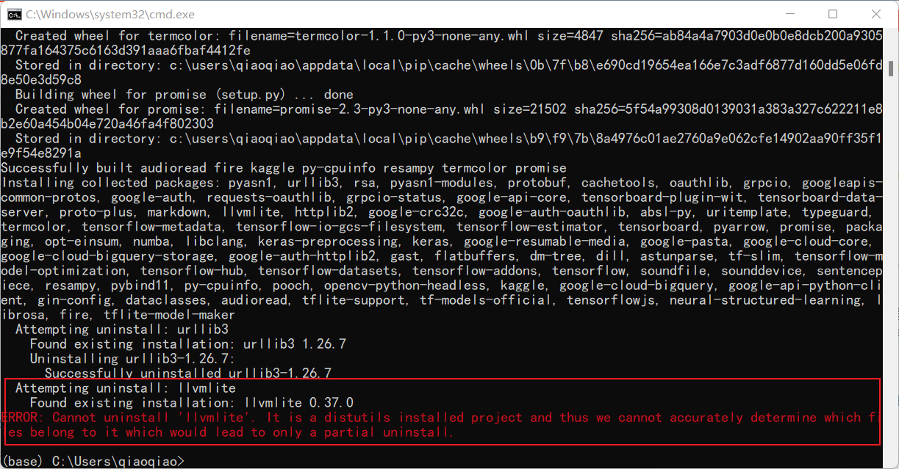

**解决方案：**
①进入`E:\Anaconda3\Lib\site-packages`找到llvmlite直接删除
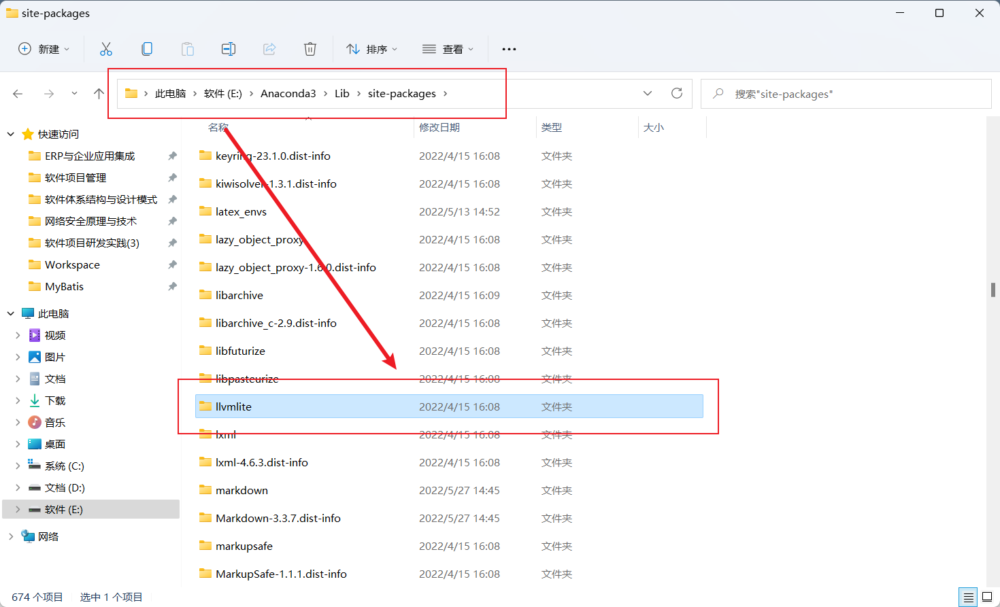
②打开Anaconda的Environments搜索llvmlite进行remove
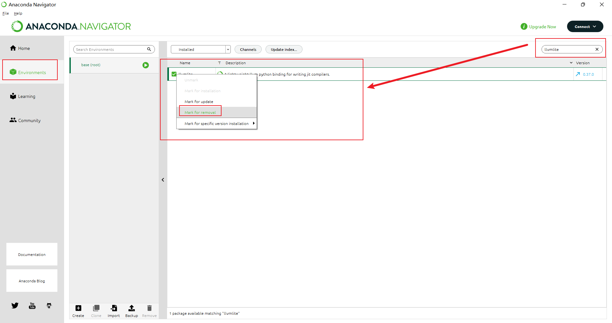
③重新install即可

```shell
pip install -i https://pypi.tuna.tsinghua.edu.cn/simple/ conda-repo-cli==1.0.4
```

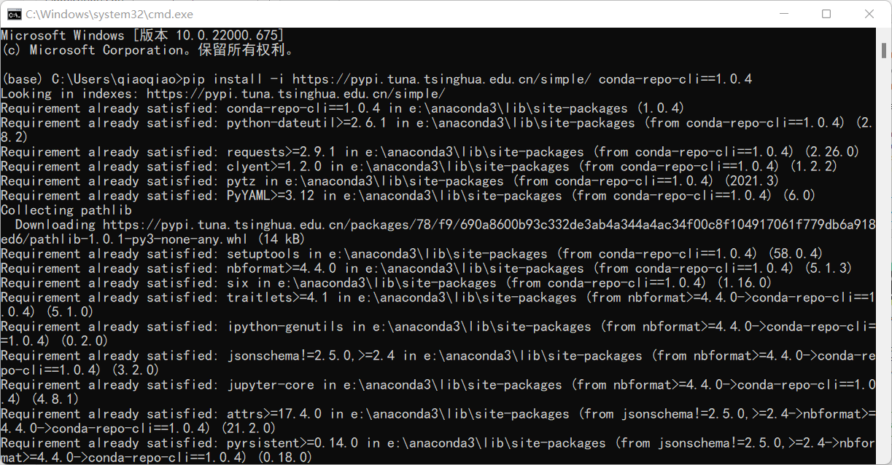

```shell
pip install -i https://pypi.tuna.tsinghua.edu.cn/simple/ anaconda-project==0.10.1
```

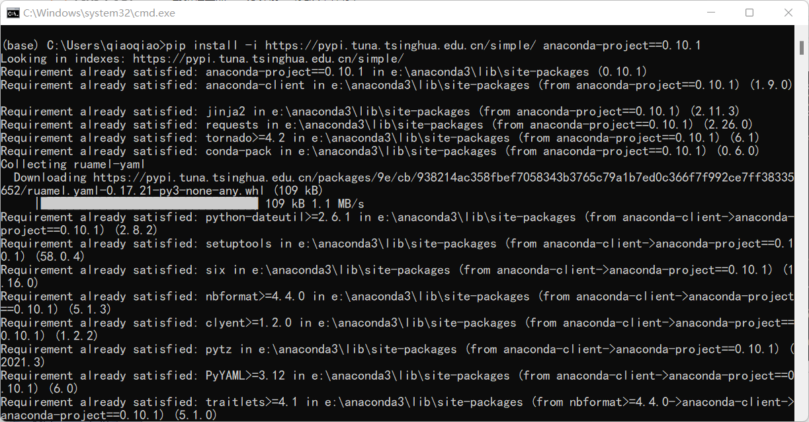

接下来，导入相关的库


```python
import os

import numpy as np

import tensorflow as tf
assert tf.__version__.startswith('2')

from tflite_model_maker import model_spec
from tflite_model_maker import image_classifier
from tflite_model_maker.config import ExportFormat
from tflite_model_maker.config import QuantizationConfig
from tflite_model_maker.image_classifier import DataLoader

import matplotlib.pyplot as plt
```

### 2、模型训练
#### ①获取数据
本实验先从较小的数据集开始训练，当然越多的数据，模型精度更高。这里从`storage.googleapis.com`中下载了本实验所需要的数据集。`image_path`可以定制，默认是在用户目录的`.keras\datasets`中。


```python
image_path = tf.keras.utils.get_file(
      'flower_photos.tgz',
      'https://storage.googleapis.com/download.tensorflow.org/example_images/flower_photos.tgz',
      extract=True)
image_path = os.path.join(os.path.dirname(image_path), 'flower_photos')
```

#### ②运行示例
**第一步：加载数据集，并将数据集分为训练数据和测试数据。**


```python
data = DataLoader.from_folder(image_path)
train_data, test_data = data.split(0.9)
print(train_data.size)
print(test_data.size)
```

    INFO:tensorflow:Load image with size: 3670, num_label: 5, labels: daisy, dandelion, roses, sunflowers, tulips.
    3303
    367
    

**第二步：训练Tensorflow模型**


```python
inception_v3_spec = image_classifier.ModelSpec(uri='D:\Workspace\JupyterNotebookFiles\E5\efficientnet_lite0_feature-vector_2')
# inception_v3_spec = image_classifier.ModelSpec(uri='https://storage.googleapis.com/tfhub-modules/tensorflow/efficientnet/lite0/feature-vector/2.tar.gz')
inception_v3_spec.input_image_shape = [240, 240]
model = image_classifier.create(train_data, model_spec=inception_v3_spec)
# 使用默认模型
# model = image_classifier.create(train_data)
```

    INFO:tensorflow:Retraining the models...
    Model: "sequential"
    _________________________________________________________________
     Layer (type)                Output Shape              Param #   
    =================================================================
     hub_keras_layer_v1v2 (HubKe  (None, 1280)             3413024   
     rasLayerV1V2)                                                   
                                                                     
     dropout (Dropout)           (None, 1280)              0         
                                                                     
     dense (Dense)               (None, 5)                 6405      
                                                                     
    =================================================================
    Total params: 3,419,429
    Trainable params: 6,405
    Non-trainable params: 3,413,024
    _________________________________________________________________
    None
    Epoch 1/5
    

    E:\Anaconda3\lib\site-packages\keras\optimizers\optimizer_v2\gradient_descent.py:108: UserWarning: The `lr` argument is deprecated, use `learning_rate` instead.
      super(SGD, self).__init__(name, **kwargs)
    

    103/103 [==============================] - 62s 582ms/step - loss: 0.8861 - accuracy: 0.7609
    Epoch 2/5
    103/103 [==============================] - 61s 587ms/step - loss: 0.6605 - accuracy: 0.8908
    Epoch 3/5
    103/103 [==============================] - 79s 771ms/step - loss: 0.6231 - accuracy: 0.9135
    Epoch 4/5
    103/103 [==============================] - 64s 617ms/step - loss: 0.6060 - accuracy: 0.9235
    Epoch 5/5
    103/103 [==============================] - 60s 578ms/step - loss: 0.5943 - accuracy: 0.9320
    

因为某些原因，运行以上代码可能会报错`TimeoutError:[WinError 10060]`，此时使用代理或者切换网络都无济于事

**解决方案**
1. 进入目录：`E:\Anaconda3\Lib\site-packages\tensorflow_examples\lite\model_maker\core\task\model_spec`

   查看`__init__.py`文件

   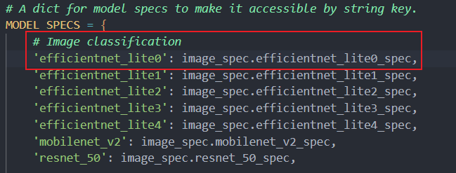

   可知代码`model = image_classifier.create(train_data)`如果不指定模型，系统默认使用的模型为`efficientnet_lite0`模型，打开`image_spec.py`文件，得知该模型的地址为https://tfhub.dev/tensorflow/efficientnet/lite0/feature-vector/2

   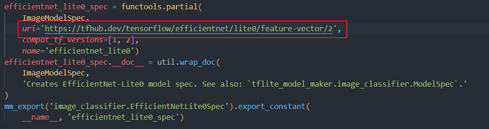

2. 进入该链接https://tfhub.dev/tensorflow/efficientnet/lite0/feature-vector/2 下载对应模型

   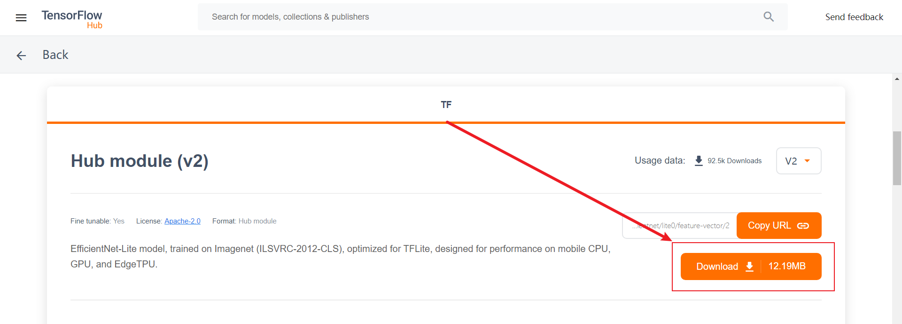

3. 更改代码，使用该模型进行`create`即可
   ```python
   # 使用默认模型，不推荐，出现网络问题
   # model = image_classifier.create(train_data)
   
   # 模型下载到本地，推荐
   inception_v3_spec = image_classifier.ModelSpec(uri='D:\Workspace\JupyterNotebookFiles\E5\efficientnet_lite0_feature-vector_2')
   
   # 使用在线模型，推荐
   # inception_v3_spec = image_classifier.ModelSpec(uri='https://storage.googleapis.com/tfhub-modules/tensorflow/efficientnet/lite0/feature-vector/2.tar.gz')
   
   inception_v3_spec.input_image_shape = [240, 240]
   model = image_classifier.create(train_data, model_spec=inception_v3_spec)
   ```

**第三步：评估模型**


```python
loss, accuracy = model.evaluate(test_data)
```

    12/12 [==============================] - 8s 546ms/step - loss: 0.5981 - accuracy: 0.9210
    

**第四步，导出Tensorflow Lite模型**

这里导出的Tensorflow Lite模型包含了元数据(metadata),其能够提供标准的模型描述。导出的模型存放在Jupyter Notebook当前的工作目录中。


```python
model.export(export_dir='.')
```

    INFO:tensorflow:Assets written to: C:\Users\qiaoqiao\AppData\Local\Temp\tmpnfwgcyad\assets
    

    E:\Anaconda3\lib\site-packages\tensorflow\lite\python\convert.py:766: UserWarning: Statistics for quantized inputs were expected, but not specified; continuing anyway.
      warnings.warn("Statistics for quantized inputs were expected, but not "
    

    INFO:tensorflow:Label file is inside the TFLite model with metadata.
    

    INFO:tensorflow:Label file is inside the TFLite model with metadata.
    

    INFO:tensorflow:Saving labels in C:\Users\qiaoqiao\AppData\Local\Temp\tmpihf96qy5\labels.txt
    

    INFO:tensorflow:Saving labels in C:\Users\qiaoqiao\AppData\Local\Temp\tmpihf96qy5\labels.txt
    

    INFO:tensorflow:TensorFlow Lite model exported successfully: .\model.tflite
    

    INFO:tensorflow:TensorFlow Lite model exported successfully: .\model.tflite
    

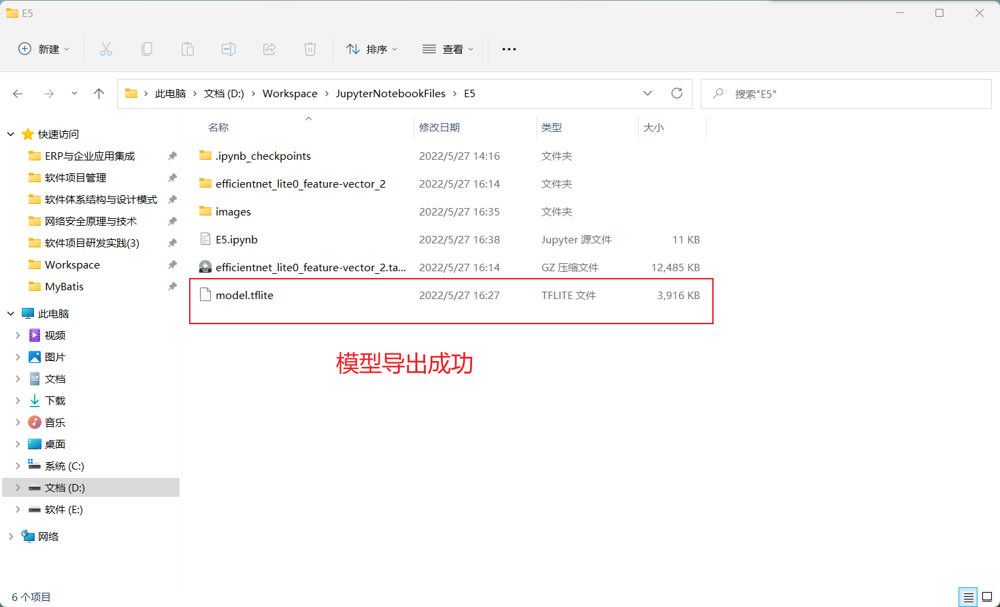

## 二、导入项目TFL_Classify
### 1、修改模型名
将导出的模型名修改为`FlowerModel.tflite`
### 2、导入项目
选择`ml->New->Other->TensorFlow Lite Model`
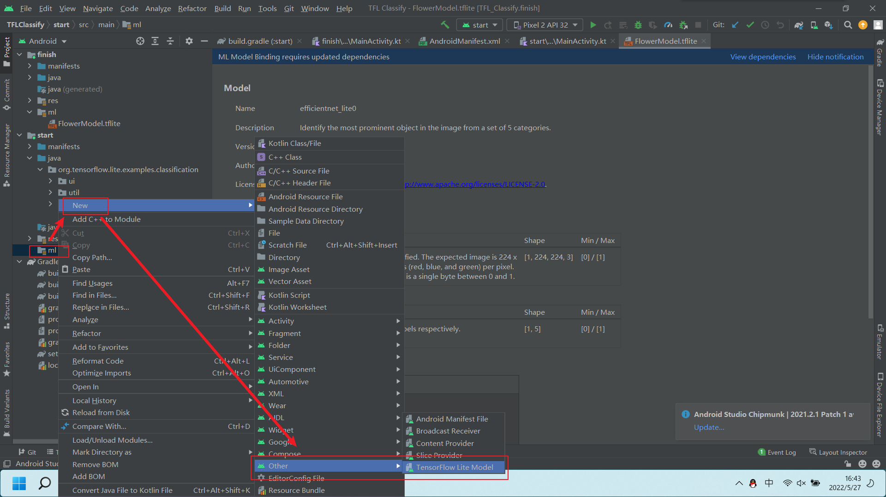
输入模型路径名即可
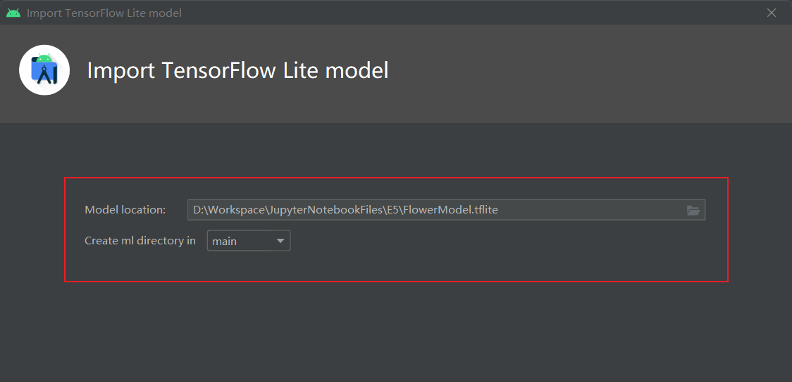
出现如下界面即导入成功
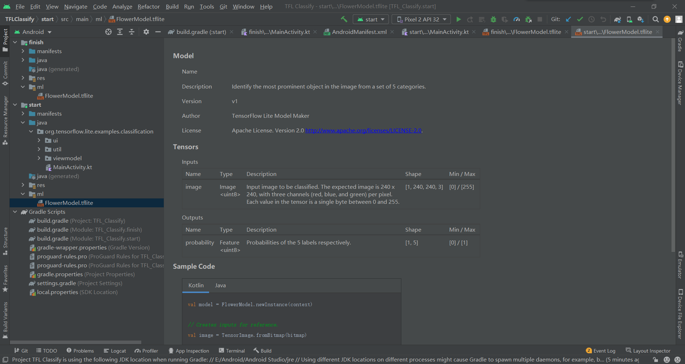
